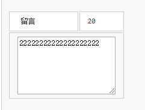

1.自定义一个求和函数 (使用JS实现)

```

```

2.自定义函数求数组 [-1,-2,1,10,4,5,8] 中的最大值？

```
 
```

3.在JavaScript中，关于document对象的方法下列就法正确的是（ ）。

```
A. getElementById()是通过元素Id获取元素对象的方法，其返回值为单个对象  
B. getElementByNames()是通过元素name获取元素对象的方法，其返回值为单个对象 
C. getElementbyId()是通过元素Id获取元素对象的方法，其返回值为单个对象  
D. getElementbyNames()是通过元素name获取元素对象的方法，其返回值为对象组

```

4.下面的代码会在 console 输出什么？

```
(function(){
 var a = b = 3;
})();

console.log("a defined? " + (typeof a !== 'undefined')); 
console.log("b defined? " + (typeof b !== 'undefined'));
```

5.下面的代码会输出 ( )

```
    var  s="abcdefg";
    alert(s.substring(1,2));
```

6.请提取下面页面里所有 a 标签的 href 里的连接地址

```
<html>
        <head>
        </head>
        <body>
            <div id="box">
                <a href="www.itxdl.cn">兄弟连</a>
                <a href="www.qq.com">腾讯</a>
                <a href="www.163.com">网易</a>
                <a href="www.1688.com">阿里</a>
                <a href="www.jd.com">京东</a>
                
            </div>
        </body>
   
    </html>
```

7.在下面的HTML文档中，编写函数test() ,实现如下功能： 
（1）当多行文本框中的字符数超过20个，截取至20个  
（2）在id为number的td中（第一行第二列）显示文本框的字符个数



