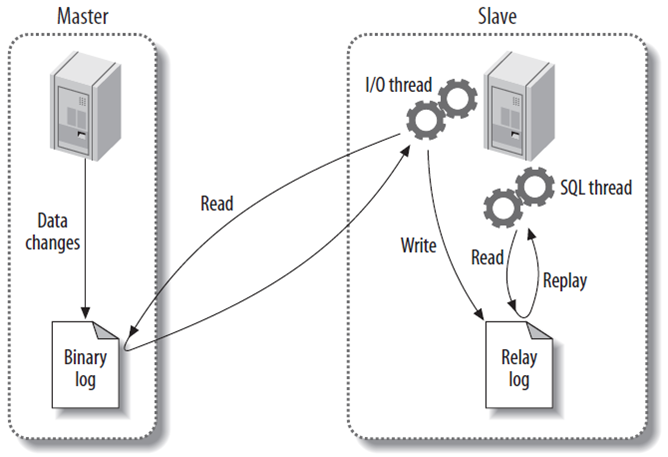

# MySQL主从 #

>教学任务：

MySQL用户授权（主从数据库用户同步数据的登录身份）

bin-log日志（用于数据同步的依据）

MySQL主从复制（主数据库修改，从数据库随之变化）

>准备：

	两台Linux	ContOS 6.*

	lamp环境已装好

	IP地址：

		主服务器(master)	192.168.202.128

		从服务器(slave)		192.168.202.129

		本机windows			192.168.2.131

		三台电脑互通

主服务器master上操作：

	mysql> select user,host,password from mysql.user;
	+------+-----------------------+-------------------------------------------+
	| user | host                  | password                                  |
	+------+-----------------------+-------------------------------------------+
	| root | localhost             | *81F5E21E35407D884A6CD4A731AEBFB6AF209E1B |
	| root | localhost.localdomain |                                           |
	| root | 127.0.0.1             |                                           |
	|      | localhost             |                                           |
	|      | localhost.localdomain |                                           |
	+------+-----------------------+-------------------------------------------+
	5 rows in set (0.01 sec)

root用户，只能在本机master登录，下面试验看能否从其它电脑登录

从服务器slave上操作
	mysql -ujack –p123 -h192.168.202.128
	ERROR 1130 (HY000): Host '192.168.202.128' is not allowed to connect to this MySQL server
	登录被拒绝，需要授权身份

## 一、授权 ##

	mysql> grant all on *.* to jack@192.168.202.129 identified by "123";

	mysql> select user,host,password from mysql.user;
	+------+-----------------------+-------------------------------------------+
	| user | host                  | password                                  |
	+------+-----------------------+-------------------------------------------+
	| root | localhost             | *81F5E21E35407D884A6CD4A731AEBFB6AF209E1B |
	| root | localhost.localdomain |                                           |
	| root | 127.0.0.1             |                                           |
	|      | localhost             |                                           |
	|      | localhost.localdomain |                                           |
	| jack | 192.168.202.129       | *23AE809DDACAF96AF0FD78ED04B6A265E05AA257 |
	+------+-----------------------+-------------------------------------------+
	6 rows in set (0.01 sec)

	授权成功，到从服务器上测试登录
	mysql -ujack -p123 -h192.168.202.128	//成功

	详细信息
		all					是权限
		*.*					是某个数据库的某个表
		jack				是登录用户名
		192.168.202.129		登录源地址，可用'%'匹配
		123					是密码

## 二、bin-log日志 ##

>bin-log：记录数据库变化操作的二进制日志文件

如何开启bin-log日志？

	1、开启
		vi /etc/my.cnf
		[mysqld]
		log-bin=mysql-bin

		ls /usr/local/mysql/data/
		mysql-bin.000001
		mysql-bin.000002
		//记录了所有的数据库变化操作(数据增删改，创建表等)

	2、查看是否开启？
		msyql>show variables like "%log%";
		log_bin   | ON			//表示开启

	3、bin-log日志刷新
		mysql>flush logs;
		//开始一个新的bin-log日志，记录此刻以后的操作

	4、查看当前使用的bin-log信息
		mysql> show master status;
		+------------------+----------+--------------+------------------+
		| File             | Position | Binlog_Do_DB | Binlog_Ignore_DB |
		+------------------+----------+--------------+------------------+
		| mysql-bin.000008 |      107 |              |                  |
		+------------------+----------+--------------+------------------+
		1 row in set (0.00 sec)

	5、清空所有的bin-log日志
		mysql>reset master;

	6、查看bin-log日志内容
		cd /usr/local/mysql/data/
		/usr/local/mysql/bin/mysqlbinlog mysql-bin.000001

	bin-log日志使用测试
		use test;
		reset master;
			清空所有的bin-log日志
		show master status;
			当前File是mysql-bin.000001 当前位置Position是107
		create table users (id int,name varchar(50));
			此时show master status发现位置Position已改变为214
		insert into users (id,name) values (1,'admin');
			此时show master status发现位置Position已改变为418
		insert into users (id,name) values (2,'guest');
			此时show master status发现位置Position已改变为622
		cd /usr/local/mysql/data
		/usr/local/mysql/bin/mysqlbinlog  mysql-bin.000001

	bin-log日志，完整记录着每一个position位置执行了什么sql语句，可以用来恢复数据
	里面的语句，可以直接拿到命令行执行

	将此时的mysql-bin.000001文件保留下来，开启一个新的日志文件
		flush logs;
		show master status;

	文件File切换为mysql-bin.000002，在这之后操作数据库，日志将记录到这个新的文件中那么mysql-bin.000001，记录的是以前的操作，此时如果误删除了数据表users。
		drop table users;

	如何通过刚才的mysql-bin.000001恢复数据？
		cd /usr/local/mysql/data
		/usr/local/mysql/bin/mysqlbinlog  mysql-bin.000001 | /usr/local/mysql/bin/mysql -uroot -p

	相当于把之前执行过的SQL语句，再执行一次，而mysql-bin.000002中，记录	的是那句删除操作，没有执行。

完整的备份及恢复实例

	1、8:00做了一个完整备份
		cd /usr/local/mysql/bin/ ./mysqldump -uroot -p123 -l -F test>'/tmp/test20160827_01.sql'

	备份test数据库到/tmp/test20160827_01.sql
	-l	备份时加锁，在整个备份期间，只允许读操作，不允许写入数据
	-F	即flush logs，可以重新生成新的日志文件，当然包括log-bin日志

	2、查看binlog日志
		mysql> show master status;

	产生了一个新的bin-log文件mysql-bin.000003
	完整备份完成之后，所有对数据库的操作，将会记录到这个新的bin-log文件中

	3、模拟8:05进行一新操作
		insert into users values (3,'jack');
		update users set name='mary' where id=2;

	4、模拟一次误操作，所有数据被清空
		delete from users;

	5、准备恢复，开始一个新的bin-log日志(目的是保留mysql-bin.000003的现状)
		flush logs;

	6、先恢复到之前的完整备份文件
		mysql -uroot -p test -f <'/tmp/test20160827_01.sql'

	7、接着恢复后面的操作(8:05分)，需要从bin-log日志中恢复

	8、查看mysql-bin.000003日志文件
		cd /usr/local/mysql/data
		/usr/local/mysql/bin/mysqlbinlog  mysql-bin.000003|more

	发现在565位置，是误操作
	# at 565
	#140821  8:33:14 server id 2  end_log_pos 645   Query   thread_id=18    exec_time=0     error_code=0
	SET TIMESTAMP=1408581194/*!*/;
	delete from users	......

	要恢复执行的操作将107行开始，在565行停止，mysql-bin.000003文件不能全部执行！！！

		/usr/local/mysql/bin/mysqlbinlog mysql-bin.000003 --start-position="107" --stop-position="565" | mysql -uroot –p123456

	9、如果服务器上有多个库，可以通过-d 选项，指定恢复哪一个数据库，而不影响其它数据库

		/usr/local/mysql/bin/mysqlbinlog mysql-bin.000003 --start-position="107" --stop-position="565" -d test | mysql -uroot –p123456

## 三、MySQL主从同步 ##
>mysql复制的优点主要包括以下3个方面:

1. 如果主服务器出现问题，可以快速切换到从服务器提供的服务
2. 可以在从服务器上执行查询操作，降低主服务器的访问压力
3. 可以在从服务器上执行备份，以避免备份期间影响主服务器的服务

注意一般只有更新不频繁的数据或者对实时性要求不高的数据可以通过从服务器查询，实时性要求高的数据仍然需要从主数据库获得

	主服务器配置
	1.授权一个用户，在从服务器上可以通过这个用户来连接主服务器
		mysql> grant all on *.* to jack@192.168.202.129 identified by "123";

		mysql> select user,host,password from mysql.user;
		mysql> show grants for jack@192.168.202.129;

		换从服务器，确保可以连上主服务器
		mysql -ujack -p123 -h192.168.202.128

	2.修改主数据库服务器的配置文件，开启bin-log并设置server-id的值（默认不需要修改）
		vi /etc/my.cnf
		[mysqld]
		log-bin=mysql-bin
		server-id=1

	3.主服务器清空所有的bin-log日志
		mysql> reset master;
		mysql> show master status;

	4.备份主数据库的数据
		cd /usr/local/mysql/bin/
		./mysqldump -uroot –p123 test -l -F >'/tmp/test.sql'

	从服务器配置
	1.把主服务器上的备份文件，拷贝到从服务器上
		scp  root@192.168.202.128:/tmp/test.sql   /tmp/test.sql

	2.从备份文件，恢复数据库
		mysql -uroot -p test -f <'/tmp/test.sql'

	3.清空所有bin-log
		mysql>reset master;		#主从服务器都清空

	4.修改配置文件
		vi /etc/my.cnf
		[mysqld]
		log-bin=mysql-bin		#第49行，已存在不需要改
		server-id =  2  		#第58行 ，修改
		binlog-do-db = test  	#新增，要复制同步的数据库

	以下根据需求添加
		log_slave_updates		= 1	# 将同步数据写入binlog日志
		read_only	= 1	# 限制用户写数据（普通用户、root等全部权限用户无法限制）
		binlog-ignore-db = mysql  # 不复制同步的数据库（黑名单/白名单）
	    binlog-ignore-db = paybank  # 不复制同步的数据库
		binlog-ignore-db = performance_schema  # 不复制同步的数据库

	注意server-id要唯一,如果前面已经开启或设置 ，不要重复设置

	5.重启从数据库服务

	6.从服务器进入mysql命令行
	  ./mysql  -uroot  -p123
      mysql>stop slave;
                 Query OK,0 rows affected(0.03 sec)

      mysql> change master to
              -> master_host="192.168.202.128",
              -> master_user="jack",
              -> master_password="123";
                  Query OK,0 rows affected(0.00 sec)

      mysql> start slave;
                  Query OK,0 rows affected(0.03 sec)

	查看是否成功
	show slave status\G

	Connect_Retry: 60						如果失败，每60秒尝试一次
    Master_Log_File: mysql-bin.000002		主服务器的bin-log日志文件
    Read_Master_Log_Pos: 107				对应的位置
	Slave_IO_Running: Yes					从主服务器上读取binlog日志，并写入从服务器上的中继日志中
    Slave_SQL_Running: Yes					读取并且执行中继日志中的binlog日志
	#注：以上两个都为yes则表明成功，只要其中一个进程的状态是no，则表示复制进程停止，错误原因可以从"last_error"字段的值中看到.

	从服务器只建议做读操作，主服务器无法同步从服务器的写操作。
	完成！！！可测试查看同步情况。

	其他：
		mysql>show processlist \G

	如果主服务器在使用中，可以锁定数据库禁止写入，配好后再解锁
		mysql>flush tables with read lock;
		mysql>unlock tables;

从数据库常用命令:

	(1)start slave
	#启动复制线程
	(2)stop slave
	#停止复制线程
	(3)show slave status
	#查看从数据库状态
	(4)show master logs
	#查看主数据库bin-log日志
	(5)change master to
	#动态改变到主服务器的配置
	(6)show processlist
	#查看从数据库运行进程

报错处理：

	从数据库无法同步:
	Show slave status显示Slave_SQL_Running为No,Seconds_Behind_Master为null
	原因:
	a.程序可能在slave上进行了写操作
	b.也可能是slave机器重起后，事务回滚造成的.
	解决:方法一
	Mysql>slave stop;
	Mysql>set GLOBAL SQL_SLAVE_SKIP_COUNTER=1;
	Mysql>slave start;

	解决:方法二
	Slave 库，MySQL> slave stop; --停掉slave服务
	Master 库，MySQL> show master status;
	得到主服务器上当前的二进制日志名和偏移量
	+------------------+----------+--------------+------------------+
	| File             | Position | Binlog_Do_DB | Binlog_Ignore_DB |
	+------------------+----------+--------------+------------------+
	| mysql-bin.000005 |      106 |              |                  |
	+------------------+----------+--------------+------------------+

	查看状态 ，然后到slave服务器上执行手动同步
	mysql>change master to
	master_host="192.168.8.123",
	master_user="jack",
	master_password='123',
	master_port=3306,
	master_log_file="mysql-bin.000005",
	master_log_pos= 106;
	启动slave服务，
	Mysql>slave start;
	通过show slave status查看Slave_SQL_Running为Yes,
	Seconds_Behind_Master为0 即为正常

